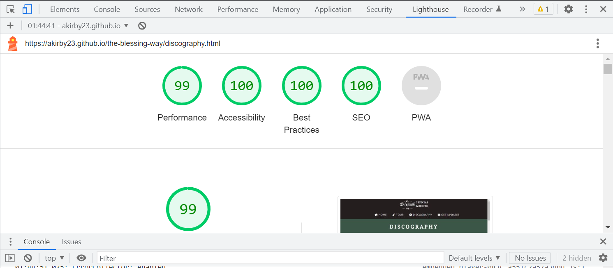

# The Blessing Way

## Description
This website is aimed at showcasing & promoting the music of the Irish solo-project The Blessing Way. 
Targetted towards heavy metal music fans as well as new & existing fans of the project, the website provides a brief overview on the history of The Blessing Way, an introduction to their discography, information on the upcoming tour and where their music can be streamed.
Users will find this useful to keep up to date with the latest album releases & tour dates. 

## User Experience
### Features
- Implemented features

  - Header
    - The header contains The Blessing Way’s logo, which decorates each page nicely in line with the theme of the website while also allowing the user to easily navigate back to the home page by clicking on it. 
    - It also contains a responsive navigation bar which features on all 4 pages, allowing the user to easily navigate between pages without the need to use the “back” button to go back to the previous page. 
    - On larger screens, each of the navigation links contains a corresponding icon which contributes to the intuitive design while also making the header more aesthetically pleasing. 

     

  - Biography section
    - The biography section contains an eye-catching text box that will give the user a brief introduction to The Blessing Way, complimented by a black, white & grey background image of a live concert to match the theme of heavy metal music. 

    
  
  - New album section 
    - The New Album section promotes the release of The Blessing Way’s newest album, Erik’s Lament. 
    - This section informs the user that the album is now available to stream on Bandcamp, Spotify and YouTube. 
    - The accompanying image features the album cover of Erik’s Lament on a mobile device to entice the user to stream the album. 
 

  - Tour Section
    - This section advertises the upcoming Ireland Tour and contains a list of tour locations, the date & time of the events and the address of the venues. 
    - The locations of each of the events are pinpointed on a corresponding map iframe to allow the user to easily plan their trip and/or navigate to the venue. 

 

  - Discography page 
    - The Discography pages provides the user with an overview of all of the albums that have been released by The Blessing Way to date. 
    - The album covers are displayed on the page accompanied by the title of the album, the release date and a description of the album. 
    - The iframes sourced from Bandcamp allow the user to listen to the album directly on the website, or navigate to the Bandcamp website to buy or share the album by clicking on the links within the media player. 
    - For a better user experience, the iframes will not autoplay. 
    - In the interest of maintaining responsiveness on smaller screens, the iframes are not visible on screens 450px wide and below. 

 

  - Sign up page
    - The sign up page contains a form that will allow the user to sign up for The Blessing Way’s Newsletter. 
    - The user is just required to fill in their First Name, Last Name & Email Address, making it quick & easy for them to get signed up. 
    - Placeholder text has been placed within the input fields for a more intuitive design. 
    - The input type for the email input box has been set to “email” to prevent the user from inputting invalid data. 

 

  - Thank you page
    - Upon submission of the form on the sign up page, the user is taken to the Thank You page which thanks the user for signing up to the newsletter, informs them that they have been successful in signing up & that they will be redirected back to the home page.
    - This page is set up to auto-refresh after 10 seconds and redirect the user back to the home page, which prevents the need for the user to press the “back” button to exit it.

     

  - Footer
    - The footer contains Facebook, Bandcamp, Spotify & YouTube icons which are linked to The Blessing Way’s corresponding pages. Clicking on the icon will open the respective link in a new tab for better user experience.
    - Below the social media links is a disclaimer which lets the user know that the website has been created for educational purposes only.
   - The footer is fixed to the bottom of the page which allows the user to access the social media links any time.  

    

### Features left to implement
 - Add the option for users to purchase tickets for the upcoming tour events.

### Design
- Color

   - The color palette was generated from the album cover of The Blessing Way’s newest album, Erik’s Lament. 

   - As the home page draws the user’s attention to the exciting release of the new album, it felt fitting for the website’s color scheme to match the album cover. 

- Typography

  - Noto Serif Devanagari was used for the main header elements throughout the website, with serif as a fallback, to match the classical feel of the latest album, Erik's Lament. 
  - To compliment the headings, Open Sans with sans-serif as a fallback was used for the rest of the text elements on the website. 
  - The fonts above were imported from Google Fonts. 

## Technologies used

### Languages
- HTML was used to build the content of the website.
- CSS was used to style the content of the website. 

### Frameworks, Libraries & Programs Used
- [CodeAnywhere](https://app.codeanywhere.com/): to write the code. 
- [Git](https://git-scm.com/): to commit & push the code to Github. 
- [GitHub](https://github.com/): to store the code in its repository. 
- [GitHub Pages](https://pages.github.com/): to deploy the website.
- [Chrome DevTools](https://developer.chrome.com/docs/devtools/): for testing responsiveness on various screen sizes & for troubleshooting issues. 
- [Google Fonts](https://fonts.google.com/): to import Noto Serif Devanagari & Open Sans fonts which were used on all HTML pages. 
- [Font Awesome](https://fontawesome.com/): to import iconds to add to the navigation bar & to the tour section for aesthetic & UX purposes. 
- [ImageColorPicker](https://imagecolorpicker.com/): to generate the colour palette for the website.
- [Coolors.co](https://coolors.co/241e20-8c6a4f-ffffff-3c5648-76a38f): to generate the colour palette for the README.  
- [PosterMyWall](https://www.postermywall.com/index.php/posterbuilder/copy/f5550b1adaac0ea5e27966d9ef9b3af5#.ZEU7i3bMKUk): to generate the image for the New Album section. 
- [Favicon](https://favicon.io/): to generate the favicon images & to obtain links to add the favicon to all pages. 
- [AmIResponsive](https://ui.dev/amiresponsive): to test the website's responsiveness on screens of different sizes. 

## Testing

### Validator Testing

- No errors were found when the website was run through the [W3C Validator](https://validator.w3.org/)

- No errors were found when the website was run through the [W3C CSS Validator](https://jigsaw.w3.org/css-validator/)

### Accessibility Testing
Lighthouse reports were run on all 4 HTML pages for both mobile & desktop.

<!-- Dropdown menu for Lighthouse reports -->
<!-- index.html Lighthouse reports -->

index.html - Desktop

- Overall, the index.html page performed well on desktop.

index.html - Mobile

- Overall, the index.html page performed well on mobile.

<!-- discography.html Lighthouse reports -->

discography.html - Desktop

- Overall, the discography.html page performed well on desktop.

discography.html - Mobile

- Overall, the discography.html page performed well on mobile.

<!-- form.html Lighthouse reports -->

form.html - Desktop

- Overall, the form.html page performed well on desktop.

form.html - Mobile

- Overall, the form.html page performed well on desktop.

<!-- thank-you.html Lighthouse reports -->

thank-you.html - Desktop

- The accessibility score suffered a bit as a result of the auto-refresh HTML code. 
- Otherwise, the thank-you.html page performed well on desktop. 

thank-you.html - Mobile

- The accessibility score suffered a bit as a result of the auto-refresh HTML code. 
- Otherwise, the thank-you.html page performed well on desktop.

### Manual Testing
- The website was testing on Google Chrome, Microsoft Edge, Firefox & Opera. 
  - It performed as expected, with the exception of 1 bug which has been noted in the bugs section below. 
- Links were tested to ensure that they open the correct page in a separate tab. 
- Chrome DevTools & AmIResponsive were used to test the website's responsiveness on mobile phones, tablets, laptops & desktops. 

### Bugs

| Issue | Notes | Status
| ---| ---| ---|
|Footer floating in the middle of form.html & thank-you.html pages|Fixed positioning was added to footer, which caused overlap on the bottom of the Tour & Discography sections. Padding was added to the bottom of both sections to resolve this.| Fixed| 
|Border on anchor elements in the navigation bar when the link is active on Firefox|The border has been styled on the bottom only therefore this is not expected behaviour.| Not fixed - issue does not degrade UX

## Deployment
The site was deployed to GitHub pages. The steps to deploy are as follows:
 - In the GitHub repository, navigate to the Settings tab.
 - On the left hand side of the page, navigate to Pages. 
 - From the source section drop-down menu, select the Main Branch.
 - Once the main branch has been selected & saved, the page will be automatically refreshed with a detailed ribbon display to indicate the successful deployment.

## Credits 

### Code 
- [w3schools.com](https://www.w3schools.com/) & [stackoverflow.com](https://stackoverflow.com/) were consulted regularly for support with both HTML & CSS. 
- [css-tricks.com](https://css-tricks.com/snippets/css/a-guide-to-flexbox/) was consulted for support with implementing Flexbox for responsive styling. 
- HTML to enable smooth scrolling behaviour was obtained from [gomakethings.com](https://gomakethings.com/smooth-scrolling-links-with-only-css/)
- Inspiration for the layout of the Biography section was taken from the Love Running website. 
- Inspiration for the shadow on button hover was taken from [w3schools.com](https://www.w3schools.com/css/css3_buttons.asp).

### Content 
- The Biograpy section as well as the album descriptions in the Discography section were written with the help of Ollie Gill. 
- The rest of the content was written by [Aoife](https://github.com/akirby23). 

### Media 
- The background image from the Biography section was obtained from [RawPixel.com](https://www.rawpixel.com/image/2333597/premium-photo-image-concert-microphone-rock-band)
- The Blessing Way logo image, album cover images & Favicon image were sourced from [The Blessing Way's Bandcamp page](https://theblessingway.bandcamp.com/community). 
- The maps from the Tour section were sourced from [Google Maps](https://www.google.com/maps). 
- The media players from the Discography page were sourced from [The Blessing Way's Bandcamp page](https://theblessingway.bandcamp.com/music). 

### Acknowledgements
- My mentor Derek McAuley for taking the time to look over my code and for providing me with feedback along the way. Derek provided me with the HTML code that automatically refreshes the page back to the index.html page after submitting the form. 
- My partner Ollie Gill for supporting me with writing the content for the website. 
- My friend Josip Potnar for providing me with tips & tricks including introducing me to Flexbox, Favicons & [ui.dev/amiresponsive](https://ui.dev/amiresponsive).